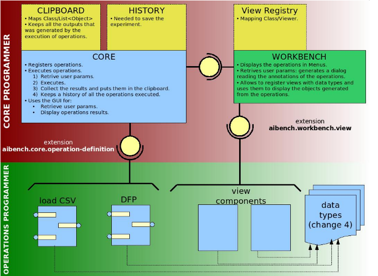

Architecture of AIBench
***********************

The next figure shows an overview of the AIBench framework. The green zone
indicates that the :ref:`Operations <creating-operations>` programmer role
(which is the regular user of the framework) has to develop his own
:ref:`Operations <creating-operations>`, :ref:`Datatypes <creating-operations>`
and :ref:`Views <creating-views>`.  The red zone shows that the core programmer
role maintains the Core and the Workbench (detailed later). Normally, you will
program your application acting as an :ref:`Operations <creating-operations>`
programmer.

In summary, the :ref:`Operations <creating-operations>` programmer builds this
type of artifacts:

- **Operations**. The units of logic (see :ref:`creating-operations`).
- **Datatypes**. Normal Java classes used as input and output of the
  Operations (see :ref:`creating-operations`).
- **Views**. Classes that inherits from ``JComponent`` and are used to display
  the Datatypes inside the Workbench (see :ref:`creating-views`).

.. _plugins-architecture:

Plugin-based architecture
=========================

AIBench uses a **plugin engine** to provide advanced capabilities, such as
dynamic discovering and loading of your :ref:`Operations <creating-operations>`
at the application startup.  You need to know the basics of this engine in order
to develop applications with AIBench. Concretely, what you need about AIBench
plugins is:

- A plugin is a set of classes, isolated (by default) from the rest classes
  belonging to other plugins.
- A plugin can define extension points (the yellow circles in the figure). An
  extension point is a place where other plugins can be connected to and then
  discovered and used at run-time. Optionally, an extension point could
  establish a Java interface that must be implemented by the plugins connected
  to it.
- A plugin can use the classes from other plugin only if a **dependency** from
  the first to the second has been defined.

AIBench is based on plugins. Not only AIBench-based applications are structured
on plugins (see :doc:`multiplugin`), but also the internals of the framework.
There are two main built-in plugins:
    
- ``Core`` plugin. Registers your operations, executes them upon user requests,
  and collects their results. Inside this plugin, the :ref:`Clipboard
  <clipboard>` keeps track of all generated results, and the *History* saves all
  the operations that have been executed in order to repeat all the session in
  the future.
- ``Workbench`` plugin. Implements User Interface for AIBench applications using
  Java Swing. Its main responsibility is to display operations in menus,
  retrieve user parameters via **automatically-generated** dialogs, displays the
  :ref:`Clipboard <clipboard>` and *History* contents and brings-up :ref:`Views
  <creating-views>` of data when user requests it.

These two plugins are communicated internally by an extension point (the top one
in the last figure), but this is out of the scope of this document.

Also, the ``Core`` plugin implements the extensible AIBench Operation Model by
the definition of an extension point called
``AIBench.core.operation-definition``.  In order to add Operations to AIBench,
you have to put them in a plugin and connect it to this extension point. There
is not any required interface to implement.

The ``Workbench`` plugin implements the Workbench user interface and also
defines an extension point called ``AIBench.core.workbench.view``. To register a
view component associated with a :ref:`Datatype <creating-operations>`, you have
to put your component in a plugin and connect it to this extension point. There
is not any required interface to implement.  The user :ref:`Datatypes
<creating-operations>` have to be placed inside a plugin, but this plugin
doesn't need to be connected to any extension point. (Please note that if some
of your Operations use these :ref:`Datatypes <creating-operations>` and reside
in other plugins, they must depend on this plugin).

You can take advantage of this plugin architecture for your applications. See
:doc:`multiplugin`.

.. _the-plugin-xml-file:

The ``plugin.xml`` file
=======================

The connection and dependency between plugins is made through the ``plugin.xml``
file present in every plugin (located at ``src/main/resources``). Here is an
example of a ``plugin.xml`` file.

.. code-block:: xml

  <plugin start="false">
    <uid>geneCBR.preprocessing.dfp</uid>
    <name>GeneCBR's DFP</name>
    <version>1.0.0</version>

    <!-- DEPENDENCIES: This plugin depends in other that define 
    some data-types needed by the operations present in this plugin -->
    <dependencies>
      <dependency uid="sing.datatypes"/>
    </dependencies>

    <!-- EXTENSIONS: The extensions that this plugin in connected to -->
    <extensions>

      <!-- EXTESION 1. Each Operation is plugged in the CORE with its 
      AIBench.core.operation- definition extension -->
      <extension
        uid="aibench.core"
        name="aibench.core.operation-definition"
        class="es.uvigo.ei.sing.geneCBR.dfp.DFPOperation">

        <!-- Additional operation info -->
        <operation-description
        name="Discriminant Fuzzy Patterns Filtering"
        uid= "geneCBR.preprocessing.dfp"
        path="3@Preprocessing/1@Feature selection/"/>
      </extension>

      <!--EXTENSION 2. The Graphical-related information is given 
      extending the Workbench with its AIBench.workbench.view extension -->
      <extension
        uid="aibench.workbench"
        name="aibench.workbench.view" >

          <icon-operation
            operation="geneCBR.preprocessing.dfp"
            icon="icons/patterns.png"/>

            <view
              name="Feature Selection Results View"
              datatype="es.uvigo.ei.sing.datatypes.featureselection.FeatureSelectionResults"
              class="es.uvigo.ei.sing.datatypes.gui.FeatureSelectionResultsViewer"/>

            <icon-datatype
              datatype="es.uvigo.ei.sing.jcbr.casebase.ExemplarsModelCaseBase"
              icon="icons/cbase.gif"/>
              
      </extension>
    </extensions>
  </plugin>

In the example, you can see that:

- The plugin has an unique identifier (uid), that is useful to reference this
  plugin from others.
- The plugin defines its dependencies on others with the <dependencies> and
  <dependency> tags.
- The plugin is connected to extension points using the <extensions> and
  <extension> tags.

  .. note::
    
    Where is the ``plugin.xml`` file? It is located in ``src/main/resources``
    folder.
    
.. _aibench-application-directory:

AIBench application directory
=============================

Once you :ref:`build your application <build-application>`, a directory
structure is created inside ``target/dist``:

.. code-block:: console

  .
  ├── conf
  │   ├── aibench.conf
  │   ├── core.conf
  │   ├── log4jconfig
  │   ├── pluginmanager.conf
  │   ├── plugins.conf
  │   ├── template.xml
  │   └── workbench.conf
  ├── lib
  │   ├── aibench-aibench-2.8.0-SNAPSHOT.jar
  │   ├── javatar-2.5.jar
  │   ├── jhall-2.0.jar
  │   └── log4j-1.2.12.jar
  ├── plugins_bin
  │   ├── aibench-core-[version].jar
  │   ├── aibench-pluginmanager-[version].jar
  │   ├── aibench-shell-[version].jar
  │   ├── aibench-workbench-[version].jar
  │   └── my-aibench-application
  │       ├── es
  │       │   └── uvigo
  │       │       └── ei
  │       │           └── sing
  │       │               └── Sum.class
  │       └── plugin.xml
  ├── run.bat
  └── run.sh

This structure is composed of the following items:

- ``conf`` directory. The :ref:`configuration files <configuration-files>`. The
  come from the ``src/main/global-resources/conf`` :ref:`source directory
  <source-directories>`.
- ``lib`` directory. AIBench Core-libraries.
- ``plugins_bin``. Plugins conforming the application. The plugins coming from
  another project appear as ``.jar`` files.
  
    - The plugin of the current project appears as a directory (in the example
      ``my-aibench-application``). Inside this plugin goes the compiled Java
      code, as well as plugin resources, coming from the ``src/main/java`` and
      ``src/main/resources`` :ref:`source directories <source-directories>`.
    
- Launch scripts (``run.bat`` and ``run.sh``), coming from the
  ``src/main/global-resources`` :ref:`source directory <source-directories>`.