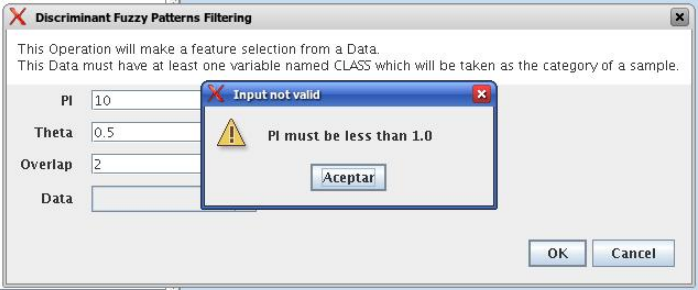
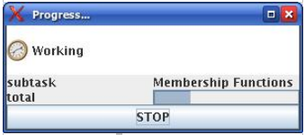
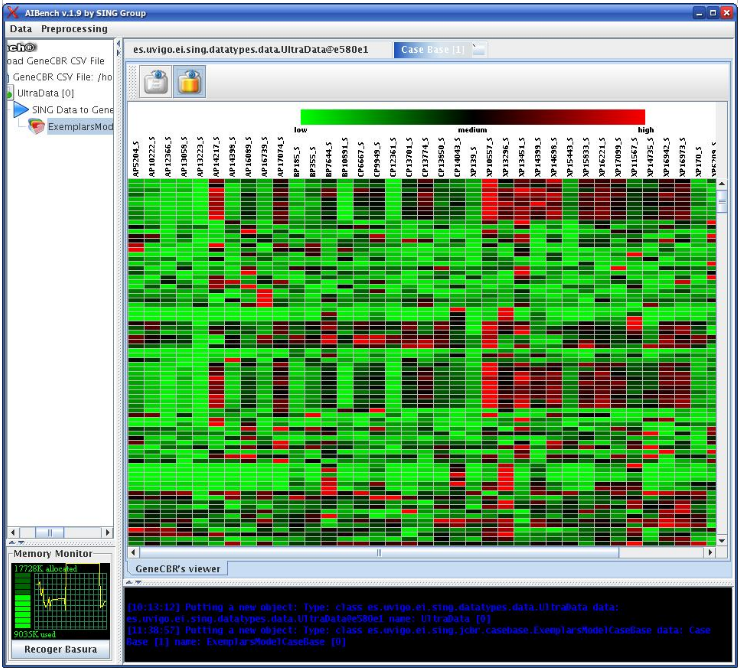

AIBench Basics
**************

.. _create-aibench-project:

Create a new AIBench Project
============================

You will need to install `Maven <http://maven.apache.org>`_.

Simply run the following command to create a new AIBench application using the
Maven archetype:

.. code-block:: console

   mvn archetype:generate -DarchetypeGroupId=es.uvigo.ei.sing \
   -DarchetypeArtifactId=aibench-archetype -DarchetypeVersion=2.6.0 \
   -DgroupId=es.uvigo.ei.sing -DartifactId=my-aibench-application \
   -DinteractiveMode=false \
   -DarchetypeCatalog=http://sing.ei.uvigo.es/maven2/archetype-catalog.xml

This command creates the new application under the folder
``my-aibench-application``. You can select the version of the archetype
(corresponding to the AIBench version) in ``-DarchetypeVersion``.

Now you can use your favourite Java Editor or IDE to start
:ref:`creating-operations`.

.. _source-directories:

Your project main directories
=============================

Once you have created your new project, this is the typical directory structure
you will find.

.. code-block:: console

  .
  ├── pom.xml
  └── src
      └── main
          ├── global-resources
          │   ├── conf
          │   │   ├── aibench.conf
          │   │   ├── core.conf
          │   │   ├── log4jconfig
          │   │   ├── pluginmanager.conf
          │   │   ├── plugins.conf
          │   │   ├── template.xml
          │   │   └── workbench.conf
          │   ├── run.bat
          │   └── run.sh
          ├── java
          │   └── es
          │       └── uvigo
          │           └── ei
          │               └── sing
          │                   └── Sum.java
          └── resources
              └── plugin.xml

The above directories include:

- ``pom.xml`` file. The Maven file controlling the build lifecycle of your
  application (see :doc:`maven` chapter). Here you will need to add your
  third-party libraries dependencies as well as other AIBench plugins
  dependencies.

- ``src/main/resources/plugin.xml``. The :ref:`plugin.xml <the-plugin-xml-file>`
  file. This file is a key file declaring all your AIBench artifacts and
  configurations.
    
- ``src/main/java``. The Java source code of your plugin. Where you add Java
  classes implementing AIBench :ref:`Operations <creating-operations>`,
  :ref:`Datatypes <creating-datatypes>` and :ref:`Views <creating-views>`.

- ``src/main/global-resources``. Resources that are application scoped, not
  plugin scoped. For example, application configuration files, and run scripts.
    
- ``src/main/resources``. Resources needed by your plugin (non-Java files), such
  as icons, text-files, etc.

Building and Running
====================
To build the project, just run:

.. code-block:: console

  cd my-aibench-application
  mvn package
  
An finally, to run your application:

.. code-block:: console

  cd target
  sh run.sh

.. _creating-operations:

Creating Operations
=====================

Defining the operations with Annotations
-------------------------------------------

An :ref:`Operation <operation>` is a Java class where each port is associated
with a method that:

- Receives the incoming data through a parameter (if the port is INPUT).
- Produces output data with the return value (if the port is OUPUT).
- Both (if the port is INPUT/OUPUT).

.. figure:: images/operation.png
   :align:  center

In order to create a new :ref:`Operation <operation>`, you need to define a
class, annotate it and connect it to AIBench through the :ref:`plugin.xml
<the-plugin-xml-file>` file that must be present in you plugins in the path
described in the chapter Downloading AIBench and building plugins. The
annotations needed to create your own operations are described bellow.

An example of an :ref:`Operation <operation>` class could be:

.. code-block:: java

   @Operation(description = "this operation adds two numbers")
   public class Sum {
     
     private int x, y;
     
     @Port(direction = Direction.INPUT, name = "x param", order = 1)
     public void setX(int x) {
       this.x = x;
     }

     @Port(direction = Direction.INPUT, name = "y param", order = 2)
     public void setY(int y) {
       this.y = y;
     }
   
     @Port(direction = Direction.OUTPUT, order = 3)
     public int sum() {
       return this.x + this.y;
     }
   }

The example defines an :ref:`Operation <operation>` with three ports: the first
two are ``INPUT`` ports and the last one is an ``OUTPUT`` port.

@Operation annotation
+++++++++++++++++++++

This annotation is a class annotation, that must be present in all
:ref:`Operation <operation>` classes. The attributes of this annotation are
showed in the following table.

+------------------+--------+---------------------------------------+-----------+
| Attribute name   | Type   | Description                           | Default   |
+==================+========+=======================================+===========+
| name             | String | The name of the Operation. This will  | empty     |
|                  |        | be used, for example, in the menus.   | string    |
|                  |        | This value also can be established    |           |
|                  |        | in the                                |           |
|                  |        | :ref:`plugin.xml<the-plugin-xml-file>`|           |
+------------------+--------+---------------------------------------+-----------+
| description      | String | A briefly description of the          | <empty    |
|                  |        | Operation. This text appears, for     | string>   |
|                  |        | example, in the header of the         |           | 
|                  |        | dynamic dialogs generated by the      |           | 
|                  |        | Workbench.                            |           |
+------------------+--------+---------------------------------------+-----------+

@Port Annotation
++++++++++++++++

With this annotation you can define all the things related with a port. This
annotation appears before the method that will be associated with the port. The
attributes of this annotation are showed in the following table.

+------------------+------------+----------------------------------+-----------+
| Attribute name   | Type       | Description                      | Default   |
+==================+============+==================================+===========+
| name             | String     | The name of the port. This text  | <empty    | 
|                  |            | will e used, for example, to     | string>   |
|                  |            | render a label in the dynamic    |           |
|                  |            | dialogs                          |           |
+------------------+------------+----------------------------------+-----------+
| description      | String     | A brief description of the port. | <empty    |
|                  |            | This text appears, for example,  | string>   | 
|                  |            | near to the respective control   |           |
|                  |            | dialogs.                         |           |
+------------------+------------+----------------------------------+-----------+
| direction        | Direction  | The data flow direction. One of: |Direction. |
|                  | (enumerated| INPUT,OUTPUT,BOTH.               |BOTH       |
|                  | type)      |                                  |           |
+------------------+------------+----------------------------------+-----------+
| order            | int        | The order in which this port is  | -1        |
|                  |            | invoked. However, INPUT/BOTH     |           |
|                  |            | ports are always invoked before  |           |
|                  |            | OUTPUT ports                     |           |
+------------------+------------+----------------------------------+-----------+
| lock             | boolean    | If this is an INPUT/BOTH port,   | false     |
|                  |            | indicate that the operation will |           |
|                  |            | write on the input object, so no |           |
|                  |            | other operations using this item |           |
|                  |            | can run in paralell              |           |
+------------------+------------+----------------------------------+-----------+
| defaultValue     | String     | The default value of the         | <empty    |
|                  |            | port (must be an INPUT or BOTH   | string>   |
|                  |            | port). This value will be used,  |           |
|                  |            | for example, to populate the     |           |
|                  |            | input dialog with default values.|           |
|                  |            | The value cannot be used to set  |           |
|                  |            | CLIPBOARD values, only           |           |
|                  |            | primitives, and for classes with |           |
|                  |            | a String constructor.            |           |
+------------------+------------+----------------------------------+-----------+
| advanced         | boolean    | Hint indicating that this        | false     |
|                  |            | parameter is not essential, so   |           |
|                  |            | its default value should be valid|           |
|                  |            | in almost all cases.             |           |
+------------------+------------+----------------------------------+-----------+

@Progress Annotation
++++++++++++++++++++

This optional annotation can be used to give a Java bean that keeps in its
properties the information related with the actual progress of the
:ref:`Operation <operation>`.  The :ref:`Operation <operation>` should call the
setter methods of the bean during its process, and the Workbench, reads them in
"real-time" showing them to the user. The annotation has no attributes, it
should be used with the method that returns that bean. An example of this
annotation can be found in Providing progress information.

Plugging operations to the AIBench's CORE
-----------------------------------------

This section shows real examples with the use of the annotations and the
configuration of the :ref:`plugin.xml<the-plugin-xml-file>` files to connect
:ref:`Operations <operation>` to the AIBench Core and how to provide GUI
components to the Workbench to render your Data-types.

Connecting operations
+++++++++++++++++++++

As it was explained before, an Operation must be connected to the core's
``AIBench.core.operation-definition`` extension. This can be done in the
:ref:`plugin.xml<the-plugin-xml-file>` file of the plugin where the
:ref:`Operation <operation>` class resides. For example

.. code-block:: xml
  
  <extension
  uid="AIBench.core"
  name="AIBench.core.operation-definition"
  class="es.uvigo.ei.sing.geneCBR.dfp.DFPOperation">

  <!-- Additional operation info -->
  <operation-description
  name="Discriminant Fuzzy Patterns Filtering"
  uid= "geneCBR.preprocessing.dfp"
  path="3@Preprocessing/1@Feature selection/"
  />
  </extension>

The relevant things are these:

- class. Is the class of the Operation.
- ``<operation-description>`` tag. Gives more information about the operation.
  - name. The name of the operation.
  - uid. An identifier useful to reference this operation from other places.
  - path. The location in the user interface where the user can find this
  operation (think in a menu). This ``path`` is defined like a file-system path,
  but each item can be preceded with a number@, that establishes a desired order
  of the option relative to others. For example: if a operation is in
  ``@1Data/`` and other in ``@2Preprocessing/``, the Workbench will create two
  menus in its main window, placing Data before of Preprocessing.

.. _validating-input: 

Validating user input
+++++++++++++++++++++

To validate the input of a port, you can use the validateMethod attribute of the
@Port annotation as it was explained before. Here you can see a simple example:

.. code-block:: java

  ... //inside the code of an operation
  @Port(name="PI", direction=Direction.INPUT, 
        description="ex: 0.9", defaultValue="0.9", 
        validateMethod="validatePI")
  public void setPI(float pi){
    this.pi=pi;
  }
  public void validatePI(float pi){
    if (pi>1.0)
      throw new IllegalArgumentException("PI must be less than 1.0");
  }
  ...

The Workbench GUI uses this information to guide the user to the correct
parameters. Figure 6 shows the validatePI method in action.

.. _providing-progress:

Providing progress information
++++++++++++++++++++++++++++++

To show detailed information about the progress of a given Operation you can use
the @Progress annotation, as it was explained before. Here you can see a simple
example:

.. code-block:: java

  @Progress
  public DFPStatus getStatus(){
  	return this.status;
  }
  @Port(direction=Direction.OUTPUT)
  public void process(){
  	//in the process we make changes in the progress bean
  	this.status.setSubtask("doing this");
  	//...
  	this.status.setSubtask("doing that");
  }

DFPOperation is an user-defined Java bean which its code could look like this:

.. code-block:: java

  public class DFPStatus {
  	private String subtask;
  	private float total=0.0f;

  	public String getSubtask() { return this.subtask; }
  	public void setSubtask(String subtask) { this.subtask = subtask; }

  	public float getTotal() { return this.total; }
  	public void setTotal(float total) { this.total = total; }
  }

The Workbench GUI will show in the progress monitor all the properties of the
bean with text labels. Please note, that the float properties will be managed in
a special manner: they will be displayed as progress bars where their position
is empty if the float value is 0.0 or less, and full if the float value is 1.0
or greater.  Figure 7 shows a progress monitor that displays a bean with two
properties: one String called “subtask” and one float called “total”.

.. _creating-datatypes:

Creating Datatypes
==================

Datatypes are **regular Java classes**. Any Java class can be a datatype.

When some operation produces an output, AIBench puts it in the :ref:`Clipboard
<clipboard>` (the global structure holding all generated objects during a
session in AIBench and suitable to use as input in subsequent operations).

Adding meta-data to datatypes
-----------------------------

Objects of your datatypes appear in the AIBench :ref:`Clipboard <clipboard>` as
'black-boxes', that is, nodes that can not be explored internally. If you want
to give access to the internal parts of your objects, you should add meta-data
to describe the *structure* of your datatypes.

This additional Datatype meta-data is given via annotations. There are three
types of Datatypes:

1. **SIMPLE** (by default), no annotation needed.
2. **LIST**. A datatype with a dynamic list of subelements. Note: Java arrays
   (with any extra information) are considered lists.
3. **COMPLEX**. A datatype with a finite number of sub-parts.

There types can be recursively assembled. For example, a COMPLEX can have
composed of an internal LIST, two COMPLEX attributes and one SIMPLE attribute.

In general, you have to use the ``@Datatype`` annotation in your Datatype, as
well as some other annotations inside those Datatypes.

@Datatype annotation
++++++++++++++++++++

+----------------+-----------+---------------------------------------+----------+
| Attribute name | Type      | Description                           | Default  |
+================+===========+=======================================+==========+
| structure      | Structure | The structure of the datatype. One of | SIMPLE   |
|                |           | ``SIMPLE``, ``LIST`` or ``COMPLEX``.  |          |
+----------------+-----------+---------------------------------------+----------+
| namingMethod   | String    | The name of a method in the class     | <empty   |
|                |           | returning the name to be shown in the | string>  |
|                |           | Clipboard tree in the application.    |          | 
+----------------+-----------+---------------------------------------+----------+
| viewable       | boolean   | If the datatype can be shown with a   | true     |
|                |           | View (default or user-provided).      |          |
+----------------+-----------+---------------------------------------+----------+
| renameable     | boolean   | If the datatype can be renamed from   | true     |
|                |           | the user interface                    |          |
+----------------+-----------+---------------------------------------+----------+
| removable      | boolean   | If the datatype can be removed from   | true     |
|                |           | the user interface                    |          |
+----------------+-----------+---------------------------------------+----------+
| setNameMethod  | String    | The name of a method to rename the    | <empty   |
|                |           | datatype.                             | string>  |
+----------------+-----------+---------------------------------------+----------+
| removeMethod   | String    | The name of a method to rename the    | <empty   |
|                |           | datatype.                             | string>  |
+----------------+-----------+---------------------------------------+----------+

@ListElements annotation
++++++++++++++++++++++++

This annotation is used inside ``@Datatypes(structure = Structure.LIST)`` to
indicate a method which returns the underlying list of elements of this Datatype
(see :ref:`datatype-examples`).

+----------------+-----------+---------------------------------------+----------+
| Attribute name | Type      | Description                           | Default  |
+================+===========+=======================================+==========+
| modifiable     | boolean   | Indicates that the user can remove    | true     |
|                |           | sub-elements of this LIST. If it is   |          |
|                |           | true, you must return the real list   |          |
|                |           | in your @ListElements method          |          |
+----------------+-----------+---------------------------------------+----------+

@Clipboard annotation
+++++++++++++++++++++

This annotation is used inside ``@Datatypes(structure = COMPLEX)`` to indicate a
method which returns a sub-part of this Datatype (see :ref:`datatype-examples`).

+----------------+-----------+---------------------------------------+----------+
| Attribute name | Type      | Description                           | Default  |
+================+===========+=======================================+==========+
| name           | String    | The name of the part to be shown in   | mandatory|
+----------------+-----------+---------------------------------------+----------+
| order          | int       | The relative order of this subpart in | MIN_VALUE|
|                |           | the whole COMPLEX Datatype.           |          |
+----------------+-----------+---------------------------------------+----------+

@Property annotation
+++++++++++++++++++++

This annotation is used inside ``@Datatypes(structure = COMPLEX)`` to indicate a
method which returns a primitive sub-part of this Datatype (see
:ref:`datatype-examples`).

+----------------+-----------+---------------------------------------+----------+
| Attribute name | Type      | Description                           | Default  |
+================+===========+=======================================+==========+
| name           | String    | The name of the part to be shown in   | mandatory|
+----------------+-----------+---------------------------------------+----------+

.. _datatype-examples: 

Datatype examples
-----------------

Here it is a ``LIST`` Datatype example:

.. code-block:: java
  
  @Datatype(structure = Structure.LIST)
  class AList {
    ...
    private List subElems;
    ...
    @ListElements
    public List getElements() {
      return subElems;
      }
  }

And a ``COMPLEX`` Datatype example:

.. code-block:: java

  @Datatype(structure=Structure.COMPLEX)
  class AComplex {
    ...
    private AList subpart;
    ...
    @Clipboard(name = "subpart1")
    public AList getSubpart(){
      return subElems;
    }
    
    @Clipboard(name = "subpart2")
    public String getSubpart2(){
      return "hello";
    }
    
    @Property(name = "simple field")
    public int simpleField(){
      return 75;
    }
  }

Advanced Datatype management
----------------------------

Renaming instances of your Datatypes
++++++++++++++++++++++++++++++++++++

The AIBench Workbench allows users to rename :ref:`Clipboard <clipboard>`
results, that is, instances of your Datatypes. In this section, we show you how
to deal with user rename requests in order to keep your objects consistent.

As mentioned before, the ``@Datatype`` annotation has a ``namingMethod`` field
to allow a customizable way to set the name of the :ref:`Clipboard <clipboard>`
elements. A problem arises when the user changes a :ref:`Clipboard <clipboard>`
item through the built-in rename functionality (via F2, or click), because the
user object isn't notified of this change and further inconsistences may occur.

The ``setNameMethod`` in the ``@Datatype`` annotation in intended for solving
this problem. When this method is defined, the user allows AIBench to
automatically notify the user object wrapped inside the :ref:`Clipboard
<clipboard>` item that its name has changed.

To use it a user must only add the following to his ``@Datatypes`` declarations:

1. The user must define a method that will receive only one argument
   (``String``) and will return ``void``.
2. As it ought to be expected, if a user defines a ``setNameMethod`` but doesn't
   define a ``namingMethod``, AIBench will not be able to further retrieve the
   correct name of the Object.

.. code-block:: java

  @Datatype(
    structure = Structure.COMPLEX,
    viewable = false,
    namingMethod="getName",
    setNameMethod="setName")
  public class Cube {

    private String name; 
    private double edge;

    public Cube(String name, double edge) {
       this.name = name;
       this.edge = edge;
    }

    public void setName(String s) {
       this.name = s;
    }

    public String getName(){
      return this.name;
    }
    ...
  }

Removing instances of your Datatypes from the Clipboard
+++++++++++++++++++++++++++++++++++++++++++++++++++++++

The user can also request removing elements from the :ref:`Clipboard
<clipboard>`.  For simple Datatypes (black-boxes) this does not poses any
special problem. However, we want to add the possibility for the user to remove
internal parts of your ``LIST`` and ``COMPLEX`` Datatypes.

In the case of ``LIST`` Datatypes, AIBench does it for you. However, in order to
work properly, **you must return the real underlying structure** in the
``@ListElements`` method.

.. code-block:: java

  @Datatype(structure=Structure.LIST)
  public class CubesList {

     private ArrayList<Cube> cubes;

     public CubesList(){
        this.cubes = new ArrayList<Cube>();
     }

     @ListElements(modifiable=true)
     public ArrayList<Cube> getCubes() {
        return this.cubes; // <---- RETURN YOUR REAL LIST INSTANCE
     }
     //...
  }

In the case of ``COMPLEX`` Datatypes you have to:

1. Set a Root Datatype to be **Not Removable** using ``removable`` in the
   ``@Datatype`` annotation of the root Datatype.

    .. code-block:: java

      @Datatype(structure=Structure.COMPLEX, removable = false)
      public class Cube {
          
          private CubeProperties properties;
          
          @Cipboard(name = "properties") // <--- a removable subpart
          public CubeProperties getProperties() {
            return this.properties;
          }
          
          public void setProperties(CubeProperties properties) {
              this.properties = properties;
          } 
       }

2. Define a ``removeMethod`` in the ``@Datatype`` annotation of the
   *sub-element*. The implementation of the method must keep your objects
   consistent, since AIBench will remove the visual item from the user
   interface.
    
    .. code-block:: java
    
      @Datatype(structure = Structure.SIMPLE, removeMethod = "remove")
      public class CubeProperties {
         private Cube owner;
         
         //...
         public void remove() {
           // 1. keep parent object consistent.
           this.owner.setCubeProperties(null);
           
           // 2. clean this element from the Clipboard. Note: this is 
           // application-specific. Here we suppose that this object is 
           // referred only by its parent, so it could be finally removed
           // from the clipboard. However, we have to do this manually using
           // the AIBench API.
           List<ClipboardItem> items = 
            Core.getInstance().getClipboard()
              .getItemsByClass(CubeProperties.class);
              
           ClipboardItem torem = null;
           for(ClipboardItem item : items) {
              if(item.getUserData().equals(this)) {
                 torem = item;
                 break;
              }
           }
           Core.getInstance().getClipboard().removeClipboardItem(torem);
          }
      }

Datatype transformers
+++++++++++++++++++++

A transformer is a helper class to transform from one instance of a *Datatype*
class into another.

To add a transformer to AIBench, you should:

1. Create a class for the transformer with a static method in charge of doing the transformation of an instance:

.. code-block:: java

  public class Transformer {
    public static DestinyDataType transform(SourceDataType sourceObject) {
    // create and return the destiny instance
    }
  }

2. Declare the transformer in :ref:`plugin.xml<the-plugin-xml-file>`

.. code-block:: xml

  <extension uid="aibench.core" 
  name="aibench.core.transformer­definition">

    <transformerdescription sourceType="org.someorg.SourceDataType" 
      destinyType="org.yourorg.YourDataType"
      transformerClass="org.yourorg.Transformer"
      methodName="transform"/>
  
  </extension>

.. _creating-views:

Creating Views
==============

As it was explained before, you can connect Views to show your :ref:`Datatypes
<creating-datatypes>` instances by extending the ``AIBench.workbench.view``
extension. This can be done in the :ref:`plugin.xml <the-plugin-xml-file>` file
of the plugin where the components classes resides. You can also give icons for
the operations and :ref:`Datatypes <creating-datatypes>`. For example:

.. code-block:: xml

  <extension uid="AIBench.workbench" name="AIBench.workbench.view" >

    <view 
      name="Feature Selection Results View" 
      datatype="es.uvigo.ei.sing.datatypes.featureselection.FeatureSelectionResults"
      class="es.uvigo.ei.sing.datatypes.gui.FeatureSelectionResultsViewer"/>

    <icon-datatype 
      datatype="es.uvigo.ei.sing.jcbr.casebase.ExemplarsModelCaseBase"
      icon="icons/cbase.gif"/>

    <icon-operation 
      operation="geneCBR.preprocessing.dfp" 
      icon="icons/patterns.png"/>

  </extension>
  
The code in the example does this:

1. Defines a View which is defined with the ``<view>`` tag. This tag must provide:

  - ``name``. A symbolic name.
  - ``data-type``. The class of the :ref:`Datatype <creating-datatypes>` that
    this View can render.
  - ``class``. The class of the visual component. It must inherit from
    ``JComponent``.  At run-time, when an instance of the :ref:`Datatypes
    <creating-datatypes>` is created, the Workbench will create an instance of
    the component. The data instance is passed to the component in one of these
    ways:
    
    - If one field of the component class is annotated with the ``@Data``
      annotation. In this case the Workbench will look for the setter method and
      use it to inject the data instance.
    - If ``@Data`` is not present, the Workbench will look for a constructor
      with an only one parameter that must be of the same class (or superclass)
      of the :ref:`Datatype <creating-datatypes>`.

2. Defines one icon for a :ref:`Datatype <creating-datatypes>`. This can be
   done with the ``<icon-datatype>`` tag which has these attributes:
  
  - ``datatype``. The class of the :ref:`Datatype <creating-datatypes>`.
  - ``icon``. A path inside the plugin's .jar pointing to the icon's image.

3. Defines one icon for an :ref:`Operations <operation>`. This can be done with
   the ``<icon-operation>`` tag which has these attributes:

  - ``operation``. The uid of the :ref:`Operations <operation>`.
  - ``icon``. A path inside the plugin's .jar pointing to the icon's image.

An schema of the implementation of the View could be:

.. code-block:: java

  public class FeatureSelectionResultsViewer extends JPanel {
    
    private FeatureSelectionResults data;
    
    public FeatureSelectionResultsViewer(FeatureSelectionResults data) {
      this.data = data;
      
      // init JComponent components as a regular Swing component      
    }
  }
  
The next figure shows an sophisticated View used to display a :ref:`Datatype
<creating-datatypes>`.

