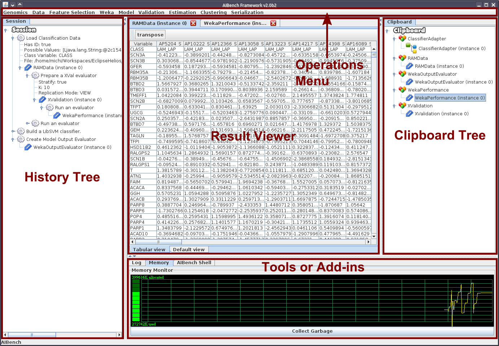
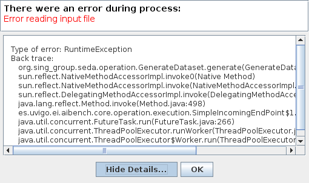

Customizing your AIBench application
************************************

.. _configuration-files:

The configuration files
=======================

AIBench comes with several configuration files in order to change its default
behavior. They are all inside the ``src/main/global-resources/conf`` directory.

- ``aibench.conf``. Basic configuration of the AIBench runtime and bootstrap
  process.
- ``core.conf``. ``Core`` plugin configuration.  It basically configures the
  thread pool size, overrides names and menu-location of :ref:`Operations
  <operation>`, and enables mutable *Datatypes* observation.
- ``workbench.conf``. ``Workbench`` plugin configuration. Override components
  visibility and placement, built-in icons, etc.
- ``template.xml``. Configure the :ref:`Workbench layout <workbench-layout>`.

.. note::

  Each plugin has its own configuration files, so which ones are used in a
  multi-plugin application? You have only :ref:`one plugin per project
  <one-plugin-per-project>`, so the ``.conf`` files of *the plugin you run
  AIBench with* (``./target/run.sh``) are the only configuration files that will
  be considered. The configuration files in dependent plugins are ignored.

.. note::

  Why ``plugin.xml`` and ``.conf`` files? As you have seen, we have a
  :ref:`plugin.xml <the-plugin-xml-file>` file inside each plugin, as well as
  configuration files. Moreover, some configurations can be done in ``.conf``,
  as well as in ``plugin.xml`` (for example, the path defining the operations
  place on the menu bar). You should keep in mind two things:

    - Configuration files override ``plugin.xml`` options. The ``plugin.xml`` is
      focused on default behavior, and configuration files are more focused on
      final customization of the application. For example, we would like to
      place a operation in *File/Import* menu when developing the plugin (we
      should use ``plugin.xml``), but if we reuse this plugin in another
      project, we may move this operation to *Dataset/Import* (here we should
      use the configuration).
    - It is a good idea to define options in the ``plugin.xml`` and, optionally
      in the configuration files. If your plugin will be reused in another
      AIBench project, remember that your configuration file will not be
      *active* in that project.

Changing the Splash Screen
==========================

You can use your own splash by changing the splashimage parameter in
``aibench.conf``.
The parameter value should be relative to ``src/main/global-resources/``. For example:

.. code-block:: jproperties

  # You should create the file: src/main/global-resources/my-splash.png
  splashimage = my-splash.png

.. _adding-icons:

Adding icons
============

Basic icons
-----------

You can add icons for Operations and for Datatypes. They are defined in
``plugin.xml``:

.. code-block:: xml

  <extension uid="aibench.workbench" name="aibench.workbench.view" >
    <icon-operation
      operation="sampleplugin.sumoperationid"
      icon="icons/oneicon.png"/>

    <big-icon-operation
      operation="sampleplugin.sumoperationid"
      icon="icons/onebigicon.png"/>

    <icon-datatype
      datatype="sampleplugin.OneClass"
      icon="icons/othericon.png"/>
  </extension>

The ``icon`` attribute indicates the path to the icon file. This path is
relative to ``src/main/resources`` of your plugin.

Overriding Workbench built-in icons
-----------------------------------

If you want to replace the Workbench (the user interface) default icons, you
have the following options in the ``workbench.conf`` configuration file.

.. code-block:: jproperties

  # Clipboard root icon
  icon.clipboard = icons/clipboard.gif
  icon.datatype = icon/datatype.png

  # Custom help icon
  paramswindow.helpicon = icons/dialog-help.png

  #  Dialog buttons customization
  #  Ok button label and text
  paramswindow.buttonicon.ok = icons/ok.png

  #  Cancel button label and text
  paramswindow.buttonicon.cancel = icons/cancel.png

  #  Help button label and text
  paramswindow.buttonicon.help = icons/help.png

.. note::

  Icon files are relative to the AIBench root directory, so you should place
  them inside ``src/main/global-resources``. In the above configuration file,
  you should create the ``icons`` subdirectory in ``src/main/global-resources``.

Menu bar icons
--------------

Menu bar icons for Operations are established using the ``icon-operation`` definitions
shown previously. However, sometimes you may also want to set icons for menu paths that
show submenus. These icons can be defined in the ``extensions`` section of the ``plugin.xml``:

.. code-block:: xml

  <extension uid="aibench.workbench" name="aibench.workbench.view" >
    <menu-icon menu="Sample" icon="conf/icons/menu/sample.png"/>
    <menu-icon menu="Sample/SubmenuExample" icon="conf/icons/menu/subsample.png"/>
  </extension>

.. _workbench-layout:

Configuring the Workbench Layout
================================

The Workbench main window shows (i) the Clipboard and the History trees at both
sides (ii) the Views showing Clipboard data in de center and (iii) additional
components like log at the bottom.

You can reconfigure this behavior very easy without recompiling the application.
The Workbench is implemented via a "table layout" configured in the
``src/main/global-resources/conf/template.xml`` file.

Here it is a possible configuration of the layout.

.. code-block:: xml

  <table>
    <row>
      <cell width="25%" oneTouchExpandable="true">
        <table>
          <row>
            <cell>
              <components id='left' />
            </cell>
          </row>
        </table>
      </cell>
      <cell width="75%">
        <table>
          <row height="80%">
            <cell width="75%">
              <document_viewer/>
            </cell>
            <cell width="25%" oneTouchExpandable="true">
              <components id='right' hidetabs="true"/>
            </cell>
          </row>
          <row height="20%" oneTouchExpandable="true">
            <cell>
              <components id='bottom'/>
            </cell>
          </row>
        </table>
      </cell>
    </row>
  </table>

Here is an example of the AIBench layout running:

As you can see in the file, the layout is very similar to an HTML table layout,
defined by rows (similar to tr) and cells (similar to td). Rows and cells can
specify a default height and width, respectively. In addition, there are two
additional tags:

  - ``document_viewer``. This tag is where the views of the Views are shown (to
    view results).  Normally, located at the center of the window.
  - ``components``. This tag defines a "slot" where one or more components could
    be placed. This slot has an ``id``, so you can place custom components at
    these slot ids (see :ref:`adding-custom-components`).

There are built-in components, such as the Clipboard tree or the Session (or
History) tree, among others. You can configure where they are placed or if they
are visible in the ``workbench.conf`` file:

.. code-block:: jproperties

  clipboardtree.visible=true
  clipboardtree.slot=right

Customizing input dialogs
=========================

If you don't like the default generated input dialog for some operation, you can
make your own dialog. Basically you have to implement a class which implements
the ``es.uvigo.ei.aibench.workbench.InputGUI`` interface and connect it
to the Workbench in the :ref:`plugin.xml
<the-plugin-xml-file>` file.

.. code-block:: xml

  <extension uid="aibench.workbench" name="aibench.workbench.view" >
     <gui-operation operation="OperationUID" class="samplePlugin.ClassName"/>
  </extension>

Here, ``samplePlugin.ClassName`` is your class implementing ``InputGUI``.

To implement this interface, you can start from scratch (more complex, more
flexible), or you can extend an existing class (easier, less flexible). But
before continuing, you have to learn how to specify parameter values for
operations in AIBench programmatically.

.. _specifying-operation-parameters:

Specifying operation parameter values in AIBench
------------------------------------------------

.. note::

  Why do we not give simple values and use ``ParamSpec``? AIBench is
  intended to make reproducible experiments, so each value should come from a
  known place, in order to be recreated in, for example, an automated
  re-execution of all the user steps. This is why we use ``ParamSpec`` and
  ``ParamSource``.

You will need to create ``ParamSpec`` instances containing (i) the value of
your parameter and (ii) **the origin** of such value, in order to be able to
recreate the value in the future (specially in the case of complex objects).

.. code-block:: java

  public ParamSpec(
    String name,
    Class<?> type,
    Object value,
    ParamSource source) throws IllegalArgumentException {
      ...
  }

  public ParamSpec(
    String name,
    Class<?> type,
    ParamSpec[] values) throws IllegalArgumentException{
      ...
  }

The first constructor is used to specify non-array values, and the second
constructor is to give array values. The ``ParamSource`` defines where the
``value`` comes from:

.. code-block:: java

  public enum ParamSource {
  	STRING,
  	STRING_CONSTRUCTOR,
  	ENUM,
  	CLIPBOARD,
  	SERIALIZED,
  	MIXED;
  }

Here you can see, where the values can be. Basically, in AIBench, a value which
is forwarded to an Operation, could be:

- A kind of "primitive" value:

  - ``STRING``. A simple string value.
  - ``STRING_CONSTRUCTOR`` which is a value
    of a class that can receive a String in the constructor to create it (for example:
    Integer, Float, Double, ... and its primitive counterparts: int, float, double).
  - ``ENUM``. An user-defined enum constant.

- A complex object:

  - ``CLIPBOARD``. The value must be a ``ClipboardItem``, that is, a value
    previously generated with a past operation execution. You can retrieve
    this kind of items interacting directly with the ``Core``, calling:

    .. code-block:: java

      Core.getInstance().getClipboard().getAllItems();

  - ``SERIALIZED``. A String with a Base64-encoded serialized Java Object.

- A recursive structure, that is, an array of ``ParamSpec``. Here we use
  ``MIXED``.

.. note::

  Create objects in this way is tedious. We provide you with a "smart" utility
  that creates ``ParamSpec`` instances for you, trying to guess the correct
  ``ParamSource``. It is the ``CoreUtils.createParams(...)`` method set. You will need to
  depend on the Core plugin (see :ref:`creating-plugin-dependencies`).

Creating your own dialog from scratch
-------------------------------------

In this alternative, you have to implement
``es.uvigo.ei.aibench.workbench.InputGUI`` interface into your viewer class and
return an array of parameter specifications:
``es.uvigo.ei.aibench.core.ParamSpec[]``.

.. code-block:: java

  public interface InputGUI {

    public void init(ParamsReceiver receiver, OperationDefinition<?> operation);

    public void onValidationError(Throwable t);

    public void finish();
  }

When the user requests the execution of a given operation, the ``init`` method
of your dialog class is invoked. Here you have to start interacting with the
user, for example bringing up a modal dialog. This method receives two
parameters: a ``ParamsReceiver`` object, which must be used to send back the
parameter values of the operation and ``OperationDefinition``, which contains
all the needed operation metadata (i.e.: its ports).

Using ``OperationDefinition``, you could construct an user interface showing the
port names, the correct component, or not showing anything to the user if you
want, for example, to treat a given port a "hidden" parameter.

When you have calculated all the parameters, you have use ``ParamsReceiver``

.. code-block:: java

  public interface ParamsReceiver {
  	public void paramsIntroduced(ParamSpec[] params);
  	public void cancel();
  	public void removeAfterTermination(List<ClipboardItem> items);
  }

With this object you can send the parameters via the ``paramsIntroduced``
method. This method receives a ``ParamSpec[]`` array, corresponding to each
input port in its corresponding order. You have to construct a ``ParamSpec``
instance for each port and send it in the array (see
:ref:`specifying-operation-parameters`). If you do not want to invoke the
operation, you should call ``cancel()`` instead. Finally, you can request
the Core to remove some clipboard items after the operation execution, you can
use ``removeAfterTermination`` before calling ``paramsIntroduced``.

Once ``paramsIntroduced`` is called, the Core will try to run the operation.
However, it will first validate the parameter values (see
:ref:`validating-input`). If the parameters were not validated, your
``onValidationError(Throwable t)`` method will be invoked. If the parameters are
ok and the operation can run, the ``finish()`` method will be called instead.

Overriding default dialogs
--------------------------

You have to extend ``es.uvigo.ei.aibench.workbench.inputgui.ParamsWindow``,
which is the class that AIBench uses as default dialog. ``ParamsWindow`` defines
the ``getParamProvider(...)`` method, intended to be overriden in order to
change the component that will be used for a given port. This visual component
and the parameter value are specified via the returning instance of the
``ParamProvider`` interface. The ``getComponent()`` method is used to specify
the component and the ``getParamSpec()`` method is used for the parameter's
value (see :ref:`specifying-operation-parameters`).

Let's see the example:

.. code-block:: java

  public class SearchInputDialog extends ParamsWindow {
      private JTextField txt = new JTextField("Example");

      protected ParamProvider getParamProvider(
           final Port port, final Class<?> arg1, final Object arg2) {

        // change the default behavior for the port named "PortName"
        if (port.name().equals("PortName")) {

            return new AbstractParamProvider() {
              public JComponent getComponent() {
                return txt;
              }

              public ParamSpec getParamSpec()
               throws IllegalArgumentException {

                return new ParamSpec(
                 port.name(), arg1, txt.getText(),
                 ParamSource.STRING_CONSTRUCTOR);
                 // more easy:
                 // return CoreUtils.createParam(arg1);
              }

              public Port getPort() {
                return port;
              }
            };
         }

         // use the default behavior for the other ports
         return super.getParamProvider(port, arg1, arg2);
     }
  }

Customizing error notifier
==========================
AIBench includes a default error dialog that is shown when an operation throw an
uncontrolled exception during execution.

As can be seen, this dialog will show the message and the stack trace of the
exception thrown. Although this is very useful during operation development, you
may want to change it for final applications or in special cases where you want
to show some specific information.

AIBench provides a way to change this dialog by just implementing an extension
point of the Workbench plugin.

Creating your own error dialog from scratch
-------------------------------------------

The first step to create a custom error dialog is to create a class that
implements the ``es.uvigo.ei.aibench.workbench.error.ErrorNotifier`` interface.

.. code-block:: java

    public interface ErrorNotifier {

        public void showError(MainWindow mainWindow, Throwable exception);

        public void showError(
            MainWindow mainWindow, Throwable exception, String message);

    }

Once you have your own ``ErrorNotifier``, you must declare it as an extension of
the extension point ``aibench.workbench.error.notifier`` of the
``aibench.workbench`` plugin. Go to the ``plugin.xml`` file of your plugin and
add the following configuration to the ``<extensions>`` block.

.. code-block:: xml

    <extensions>
        <extension uid="aibench.workbench"
                   name="aibench.workbench.error.notifier"
                   class="name.of.your.custom.ErrorNotifier"
        />
    </extensions>

Where the ``name.of.your.custom.ErrorNotifier`` should be the complete class
name of your custom error notifier.

Once this configuration is added your AIBench will start using your custom error
notifier.

Dealing with multiple error notifiers
-------------------------------------

In some cases you may have several error notifiers configured in your plugin or
in several plugins. When this happens, AIBench will use the first error notifier
that it can find in the plugins.

When this happens, it is recommended to specify which error notifier should be
used. To do so, you should add the ``error.notifier.class`` property to the
``workbench.conf`` file with the name of your custom error notifier class. For
example:

.. code-block:: jproperties

    # Custom error notifier (use "default" value for default error dialog
    error.notifier.class = my.aibench.project.CustomErrorNotifier

In addition, in case you want to use the default error notifier instead of any
custom error notifier, you can assign the ``default`` value to this property.

.. code-block:: jproperties

    # Custom error notifier (use "default" value for default error dialog
    error.notifier.class = default

Adding a Toolbar
================
The AIBench toolbar is implemented as a shortcut system.

To get the Toolbar working you have to:

- Add a new attribute in the ``operation-description`` tag in the
  :ref:`plugin.xml <the-plugin-xml-file>`, ``shortcut=<number_for_position>``.
  If it is present, the Workbench plugin will use it to place it in a toolbar.
  The specified number will be used for positioning.

  .. code-block:: xml

    <extension
      uid="aibench.core"
      name="aibench.core.operation-definition"
      class="sampleplugin.Sum">

      <operation-description
        name="Sum Operation"
        path="10@Sample/1@SubmenuExample"
        uid= "sampleplugin.sumoperationid"
        shortcut="3"/>

    </extension>

- You can also add an extra icon to show in the toolbar, for instance a larger
  icon than the default operation icon.

  .. code-block:: xml

    <extension
      uid="aibench.workbench"
      name="aibench.workbench.view" >

         <icon-operation
          operation="sampleplugin.sumoperationid"
          icon="icons/oneicon.png"/>
         <big-icon-operation
          operation="sampleplugin.sumoperationid"
          icon="icons/onebigicon.png"/>
         <icon-datatype
          datatype="sampleplugin.OneClass"
          icon="icons/othericon.png"/>

    </extension>

- To configure the toolbar in the ``workench.conf`` you have four new options:

  .. code-block:: jproperties

    # default false
    toolbar.visible=true

    # a comma-separated list of positions where a separator should
    # be placed after
    toolbar.separators=1,5,6

    # default true
    toolbar.showOperationNames=true

    # toolbar position: default NORTH
    toolbar.position=NORTH

Adding Help to your Application
===============================

1. Place your JavaHelp files in a global folder (for example:
   ``src/main/global-resources/help``).

2. Associate JavaHelp topics or URLs to:

  1. Operations. Use the ``help`` attribute in the ``operation-description``
  tag in your :ref:`plugin.xml <the-plugin-xml-file>`. The Workbench will
  display a help button in the input dialogs of this operations.

  2. Datatype Views. Use the help attribute in the ``view`` tag in your
  :ref:`plugin.xml <the-plugin-xml-file>`

Example:

.. code-block:: xml

  <extension uid="aibench.core" name="aibench.core.operation-definition" class="sampleplugin.Sum">
    <operation-description
      name="Sum Operation"
      path="10@Sample/1@SubmenuExample"
      uid= "sampleplugin.sumoperationid"
      help="mytopic.subtopic"/> <!-- using JavaHelp -->
  </extension>

  <extension uid="aibench.workbench" name="aibench.workbench.view" >
    <view name="Sample Datatype View"
      datatype="sampleplugin.OneClass"
      class="sampleplugin.OneViewComponent"
      help="http://myapp.com/help/topic1.html"/> <!-- your help could be online -->
  </extension>

Moreover, the ``Workbench`` plugin offers you a configured button 
(``es.uvigo.ei.aibench.workbench.utilities.HelpButton``) that opens this JavaHelp. For example, this 
button can be be easily added to the toolbar with:

.. code-block:: java

  Workbench.getInstance().getToolBar().add(new HelpButton());

.. _adding-custom-components:

Adding custom components
========================

You can create custom components, which are any class extending ``JComponent``,
by plugging them in your plugin.xml

.. code-block:: xml

  <extension uid="aibench.workbench" name="aibench.workbench.view" >
    <component
      slotid="bottom"
      componentid="aibench.shell.shellWindow"
      name="AIBench Shell"
      class="es.uvigo.ei.sing.aibench.shell.ShellComponent"/>
  </extension>

The ``slotid`` should exist in your ``template.xml`` file as the ``id`` of a
``components`` tag (see :ref:`workbench-layout`).

.. _adding-welcome-screen:

Adding a welcome screen
========================

You can set any component extending ``JComponent`` as welcome screen by plugging 
it in your plugin.xml. This component will be added as initial tab in the views
area when the application starts.

.. code-block:: xml

  <extension uid="aibench.workbench" name="aibench.workbench.view" >
    <welcomescreen class="org.myorg.MyComponent" title="Welcome screen"/>
  </extension>
