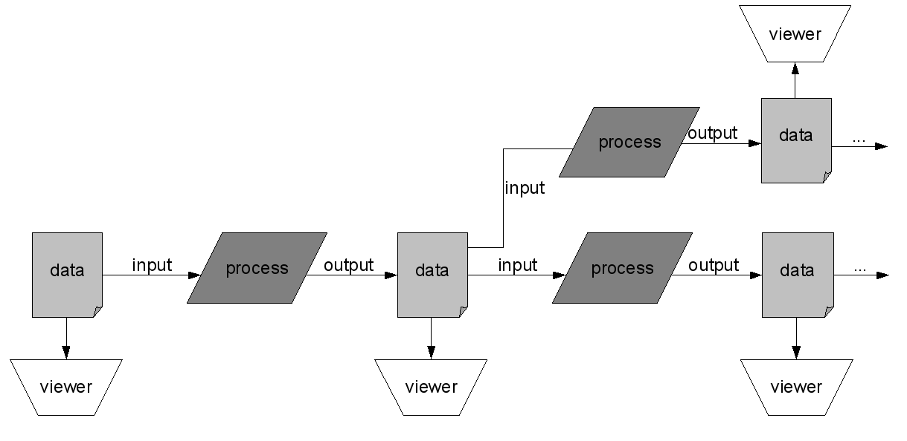
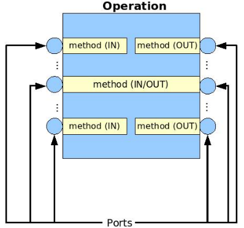
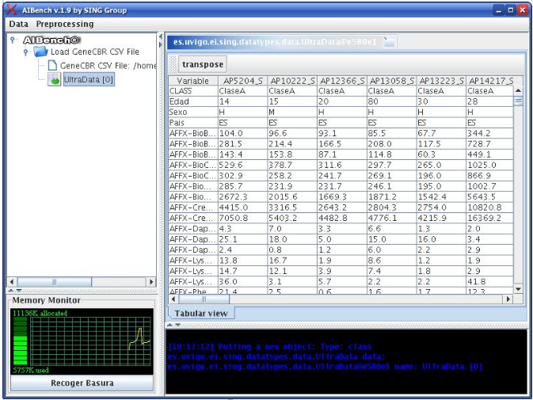
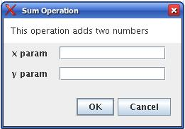
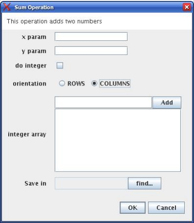
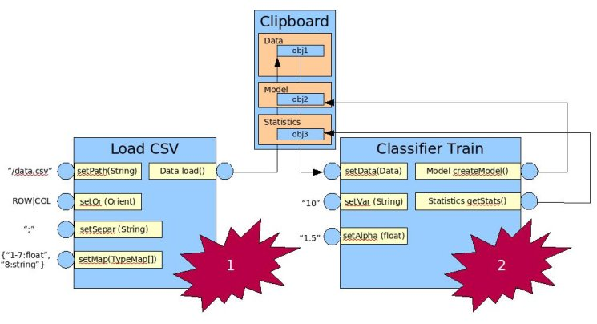

Introduction
************

What is AIBench?
================

AIBench is a lightweight, non-intrusive, Java application framework that eases
the connection, execution and integration of :ref:`Operations <operation>` with
well defined input/output to generate rich desktop applications. This basic idea
provides a powerful programming model to fast develop applications given that:

- The logic can be decoupled from the user interface.
- The interconnection of operations can also be decoupled based in the idea of
  "experiments".
- The programmer is forced to "think-before-program", easing the code reuse.

AIBench was specially designed for applications based on the *IPO model*, in
which the output of one task can be the input of another process. For example,
one application could first load some sample data from a file taking the path as
input, then execute a loading procedure and finally, generate an in-memory
data representation as output. After that procedure, its output may be forwarded
to the input of another process, say an analysis or simulation algorithm,
producing a new in-memory representation of its results as output, and so on. In
addition to this main cycle, all outputs could be rendered and displayed to the
final user at any time after being produced.

In this sense, AIBench defines three types of objects:

- :ref:`Operations <operation>`. The units of logic processing data.
- :ref:`Datatypes <creating-datatypes>`. Normal Java classes used as input and output of the
  :ref:`Operations <operation>`.
- :ref:`Views <creating-views>`. Classes that inherit from ``JComponent`` and 
  are used to display :ref:`Datatypes <creating-datatypes>` inside the 
  Workbench.

AIBench applications are distributed as *AIBench plugins* (see
:doc:`architecture`). By only copying their .jar files into a specific
directory, they will be available with just restarting AIBench.

.. _operation:

The AIBench Operation Model
===========================

AIBench defines an **Operation** in the following way:

**Operation**: Unit of logic defined through a set of *ports*. A port is a point
where some data (such as parameters, working data, etc.) can be received,
produced or both. So, the direction of a port is one of: ``INPUT``, ``OUTPUT`` or
``BOTH`` (INPUT/OUTPUT).

An Operation is a Java class where each port is associated with a method that:

- Receives the incoming data through a parameter (if the port is ``INPUT``).
- Produces output data with the return value (if the port is ``OUPUT``).
- Both (if the port is ``BOTH``).

.. code-block:: java

   @Operation(description = "this operation adds two numbers")
   public class Sum {
     
     private int x, y;
     
     @Port(direction = Direction.INPUT, name = "x param")
     public void setX(int x) {
       this.x = x;
     }

     @Port(direction = Direction.INPUT, name = "y param")
     public void setY(int y) {
       this.y = y;
     }
   
     @Port(direction = Direction.OUTPUT)
     public int sum() {
       return this.x + this.y;
     }
   }

The example defines an *Operation* with three ports: the first two are ``INPUT``
ports and the last one is an ``OUTPUT`` port.

The idea is to isolate the logic and only the logic in *Operations*. The AIBench
Core will receive the user requests and start the execution of the *Operation*.
The ports will be called with the correct parameters and the results will be
saved (see clipboard_), but the programmer doesn't need to do any of these tasks.

See :ref:`creating-operations` to learn how to create *Operations* for your
application.

.. _clipboard:

The Clipboard
=============

The *Clipboard* is the key mechanism that allows the integration between
:ref:`Operations <operation>`. It works in the following way: all the results
generated through the execution of :ref:`Operations <operation>` will be saved
in the clipboard, which is a structure that keeps these data objects classified
by their Java classes. This structure allows the user to forward the data
generated with an operation to the input of the next one.

The Workbench user interface
============================

AIBench provides a Java Swing GUI (Graphical User Interface), called Workbench,
that allows the user to request the execution of :ref:`Operations <operation>`.
The main features of the Workbench are:

- **Deployment of the available Operations in menus**. The :ref:`Operations
  <operation>` also define a logical path such as /load/csv/loadCSVFile used by
  the Workbench to create a menu hierarchy following those logical paths.
- **Dynamic generation of input dialogs**. When the user requests the execution
  of a given :ref:`Operation <operation>`, the Workbench generates an input
  dialog reflecting the input ports defined in that :ref:`Operation
  <operation>`. Depending of the data-type of each port, the control showed may
  change (see Dynamic generation of input dialogs).
- **User's input validation**. It uses the validating method provided in the
  :ref:`Operation <operation>` (if there is one) to stop the user if the
  validation didn't succeed (see :ref:`validating-input`).
- **Monitoring the process of the Operation's execution**. The more monitoring
  information the :ref:`Operation <operation>` provides, the more information
  will be displayed (see :ref:`providing-progress`).
- **Display the results of an Operation**. The Workbench provides a default View
  of the results, but you can provide more sophisticated custom components
  associated with a Data-type to display its information.

The figure shows a snapshot of the Workbench. On the left side, you can see an
tree where the operations and results are showed. On the right side, you can see
the components rendering results. In the bottom-left zone there is a memory
monitor and in the bottom-right zone there is a log window capturing the Log4J
output (http://logging.apache.org/log4j/docs).

Dynamic generation of input dialogs
-----------------------------------

Currently the dynamic generation of dialogs, maps Data-types with controls
following the policy of the following table.

+--------------------------------------------+----------------------------------+
| Data type                                  | Control used                     |
+============================================+==================================+
| Primitive Type (int, float, double, char)  | Text field                       |
+--------------------------------------------+----------------------------------+
| Boolean                                    | Check-box                        |
+--------------------------------------------+----------------------------------+
| Enum type                                  | Radio button with each option    |
+--------------------------------------------+----------------------------------+
| A class with a constructor with one        | Text field                       |
| parameter of type String                   |                                  | 
| (primitive wrapper, String...)             |                                  |
+--------------------------------------------+----------------------------------+
| java.io.File                               | Text field with a "Find..."      | 
|                                            | button that brings an file       |
|                                            | chooser dialog                   |
+--------------------------------------------+----------------------------------+
| Other class (only can take the value       | Combo box with the instances     | 
| from the CLIPBOARD)                        | of the same class available      | 
|                                            | in the                           |
|                                            | :ref:`Clipboard <clipboard>`     |
+--------------------------------------------+----------------------------------+
| Array                                      | The control inferred with the    | 
|                                            | bellow criteria, plus a list     | 
|                                            | and an “add” button to put       | 
|                                            | elements in the array            |
+--------------------------------------------+----------------------------------+

With the Sum example showed before, the Workbench generates the input dialog
like this one:

The generation of dialogs is very powerful and can generate complex dialogs like
this one:

The plugin.xml
==============

The architecture of AIBench is based on plugins (see :doc:`architecture`). The
basic functionality of AIBench is implemented in plugins. Your application,
which is a set of :ref:`Operation <operation>`, Datatypes and Views is also implemented in plugins
(at least one).

The ``plugin.xml`` file present in every plugin. In this file you will declare,
among other things, your Operations and custom Views. See
:ref:`the-plugin-xml-file` for an example.

   
Putting all together
====================

In summary, AIBench applications are a set of Operations, Datatypes and Views.
Users interact with the applications following this workflow:

1. Request an operation.
2. Give parameters in the (automatically generated) dialog.
3. Run the operation.
4. Results goes to the clipboard.
5. The user explores the results, where Views come to play.
6. The user requests more operation that may use data in the Clipboard as input,
   so this cycle starts again.

The following figures shows an example with two operations invoked by the user,
where the output of the first operation ("Load CSV") is used as one of the
inputs in the second operation ("Classifier Train").

The following figure shows an example of an AIBench application:

.. figure:: images/workbench-all.jpg
   :align:  center

