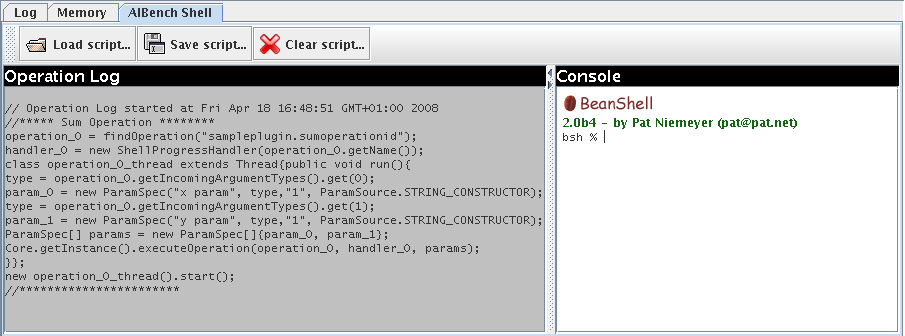

Scripting
*********

The AIBench shell plugin
========================

AIBench comes with a plugin, the ``AIBench shell`` based on `Bean Shell
<http://www.beanshell.org/>`_. When you use this plugin, an extra component is
shown in the bottom part of your application.

   
On the left side, a shell code is being generated as the user does operations.
On the right side, you can write shell code, or copy/paste code from the left
side to repeat operations.

In addition, you can save the script and load it afterwards. The execution of a
script launches operations in a concurrent way, but by preserving the data
dependencies. For example, if an operation takes as input the output of another
operation, those operations are run in sequence, not in parallel.

.. note::
  
  You can edit your script, for example, to add loops in order to repeat a 
  workflow starting from an input file over several input files.
  
Launching AIBench *headless* with a script
==========================================

Moreover, you can launch AIBench *headless*, running:

.. code-block:: console

  java -Dsing.aibench.shell.script=yourscript.bsh \
  -Daibench.nogui=true \
  -jar ./lib/aibench-aibench-2.6.0.jar